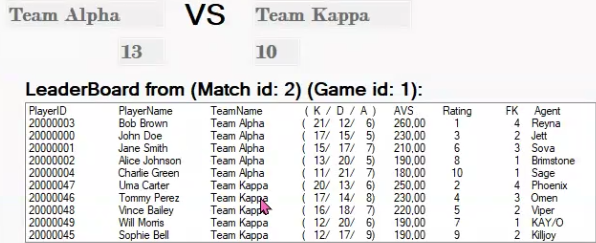

**Conteudo adicionado apos apresentacao com o prof. Joaquim Pinto**

Acho que nao ficou explicito durante a apresentacao que o nosso projeto tem ordenacao.

Aqui os jogadores estao ordenados pelo seu AVS (decrescente), primeiro todos da equipa vencedora e depois todos da equipa perdedora.

Login Encriptado com Roles para a Base de Dados.

Os logins possiveis sao:

    Username:Admin Password:cafe123
    Username:User Password:cat123

Nao e possivel adicionar/alterar dados de login.
E impossivel mudar de tab enquanto nao efetuar login.
Para alterar entre os dois usuarios possiveis basta repetir o login.

A principal diferenca e que o User so consegue ver/filtrar dados.
Recomendamos o uso do login "Admin" que consegue fazer tudo.

**String Conecao a Base de Dados**
dentro da funcao  private SqlConnection getSGBDConnection()

linha 56 do ficheiro form1.cs
linha 62 do ficheiro form2.cs

Para testar o projeto correr o DDL.sql, DML.sql e os 4 triggers, por esta ordem.

**Composicao da submicao**

Na pasta SQL encontram-se todos os ficheiros SQL separados por pastas.

Na pasta InterfaceBD-main encontra-se o projeto em Windows Forms. 
Para abrir o projeto basta abrir o ficheiro ValoLeague.sln com o visual studio 2022.
Caso prefiram podem clonar o repositorio com o mesmo trabalho em: https://github.com/FunnyJoaoneto/InterfaceBD

Na pasta Apresentacao encontra-se a apresentacao e a Demo que fizemos dia 31/05/2024 ao prof. Joaquim Pinto.
A demo foi alterada para incluir os logins.
Inclui tambem o ficheiro GuiaoDemo.txt este ficheiro e visivel no video da demo mas esta disponibilizado aqui de qualquer maneira.

DER.png contem o diagrama entidade relacao da Base de Dados.
ER.png contem o Esquema Relacional da Base de Dados.

ValoLeague.pdf contem um relatorio mais aprofundado do trabalho desenvolvido.